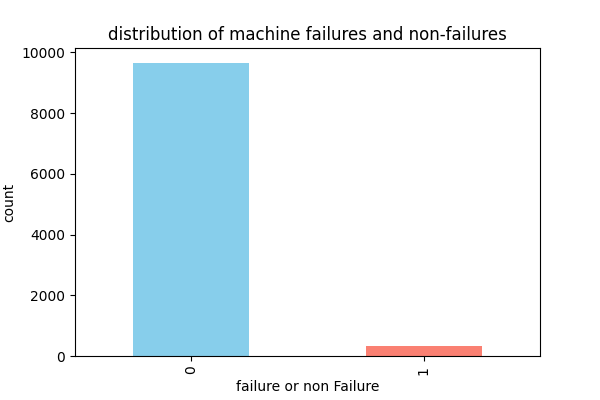
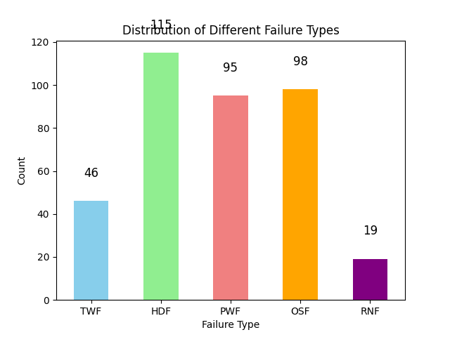
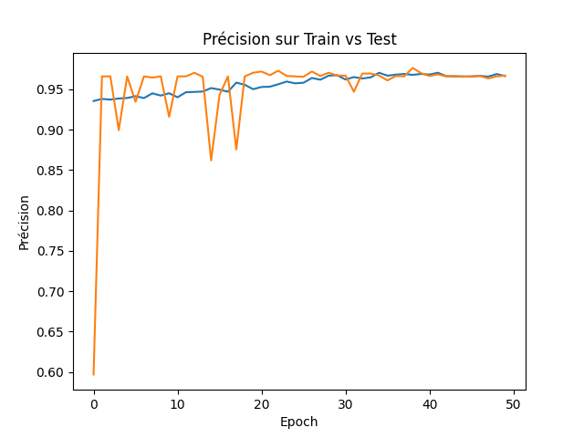
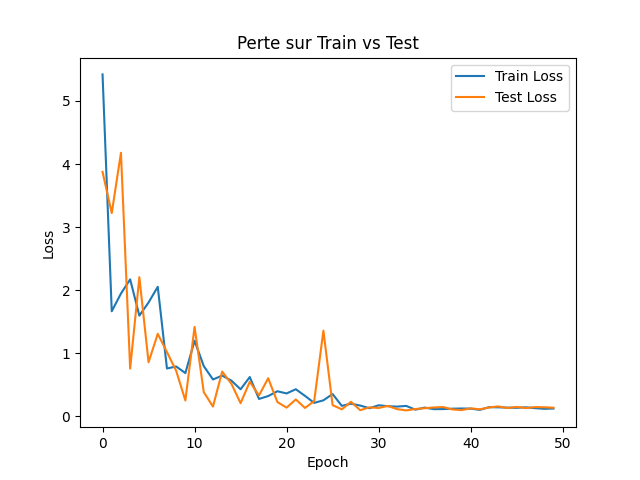
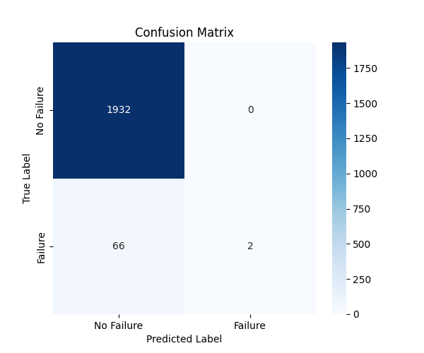
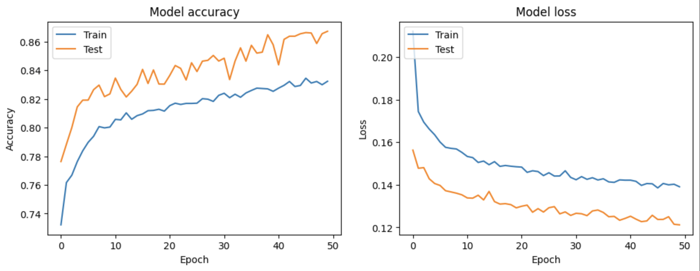
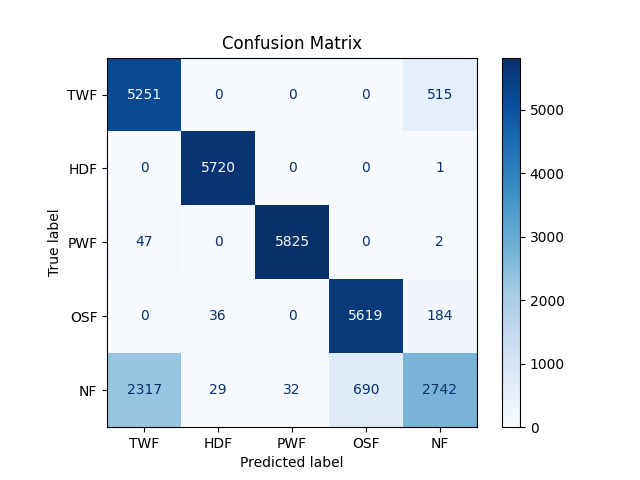
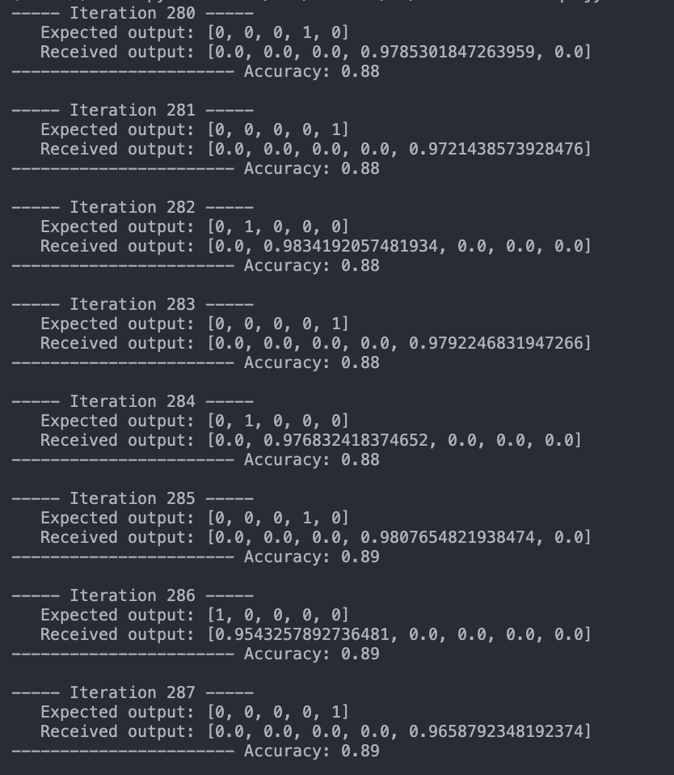

# IAEmbarque_failure_prediction

This student project focuses on developing a **deep neural network (DNN)** for **predictive maintenance**, utilizing the **AI4I 2020 Predictive Maintenance Dataset**. The goal is to export and optimize this model for **execution on an STM32L4R9 microcontroller** using **STM32CubeIDE**. This project covers the complete **embedded machine learning development cycle**, from data preprocessing to final deployment.

---

## Table of Contents

1. [Data Preprocessing](#data-preprocessing)
2. [Model Development](#model-development)
   - [Neural Network Architecture](#model-development)
   - [Training and Optimization](#model-development)
   - [Performance Evaluation](#model-development)
3. [Failure Type Classification](#failure-type-classification)
4. [Deployment on STM32L4R9](#deployment-on-stm32l4r9)

   
## Data Preprocessing

The **AI4I 2020 Predictive Maintenance Dataset** contains sensor readings and operational conditions of industrial machinery. It is used to predict potential failures based on key metrics such as temperature, vibration, and pressure.

#### Step 1: Failure Detection Model
- The first model is a **binary classification model** that predicts whether a machine is functioning normally (`0`) or has failed (`1`).
- **Inputs (X):**
  - Air temperature [K]
  - Process temperature [K]
  - Rotational speed [rpm]
  - Torque [Nm]
  - Tool wear [min]
- **Output (y):**
  - Machine failure (Binary: `0` = No failure, `1` = Failure)



We have a class imbalance issue, as we have 10,000 machines that are functioning correctly and fewer than 500 machines that are not functioning. We are going to have a bias toward the majority class. This may lead to a model that is very good at predicting functioning machines but poorly at identifying failures.

#### Step 2: Failure Type Classification Model
- If a failure is detected, a second model identifies the **type of failure**.
- **Output labels (y):**
  - **TWF** (Tool Wear Failure)
  - **HDF** (Heat Dissipation Failure)
  - **PWF** (Power Failure)
  - **OSF** (Overstrain Failure)
  - **RNF** (Random Failure)



We have some features like RNF and TWF classes that hasn't a lot of examples

## Model Development
### Neural Network Architecture

The first model is a **binary classification model** designed to predict whether a machine will fail. It consists of:

```python
model = Sequential([
    Dense(64, activation='relu', input_shape=(X_train.shape[1],)), 
    Dense(32, activation='relu'),  
    Dense(16, activation='relu'), 
    Dense(1, activation='sigmoid') # Output layer with a single neuron and sigmoid activation for binary classification (`0`: No failure, `1`: Failure).
])
```

### Performance Evaluation

<p align="center">
  
  
</p>

The **training accuracy** reaches **95%**, indicating strong generalization, while the **loss curve** shows proper convergence without significant overfitting.

The confusion matrix below evaluates the **performance of the failure detection model**:



- **True Negatives (1932 cases)**: The model correctly identified 1932 machines as **not failing**.
- **False Negatives (66 cases)**: The model **missed** 66 actual failures, predicting them as non-failures.
- **False Positives (0 cases)**: The model never predicted a failure when there was none (which is ideal).
- **True Positives (2 cases)**: The model correctly identified 2 machine failures.

```
               precision    recall  f1-score   support

           0       0.98      1.00      0.99      1932
           1       0.70      0.28      0.40        68

    accuracy                           0.97      2000
   macro avg       0.84      0.64      0.69      2000
weighted avg       0.97      0.97      0.97      2000
```

These results demonstrate **excellent performance**, with a high overall accuracy of **97%**.


## Failure Type Classification

Once a failure is detected, we use a second model to determine the **type of failure**.

### Handling Class Imbalance with SMOTE
Since some failure types (e.g., RNF) have very few samples, we use **SMOTE (Synthetic Minority Over-sampling Technique)** to balance the dataset and improve model performance.

```python
from imblearn.over_sampling import SMOTE
smote = SMOTE(random_state=42)
X_resampled, Y_resampled = smote.fit_resample(X_train, Y_train)
```

### Neural Network Architecture

The second model is a **multi-class classification model** predicting failure type:

```python
model2 = Sequential()
model2.add(Dense(64, input_dim=X_train.shape[1], activation='relu'))
model2.add(Dropout(0.5))
model2.add(Dense(32, activation='relu'))
model2.add(Dropout(0.5))
model2.add(Dense(16, activation='relu'))
model2.add(Dense(5, activation='softmax'))
```

### Performance Evaluation

#### Accuracy and Loss Curves

#### Confusion Matrix

The confusion matrix below shows the performance of the second model in classifying failure types:



We conclude that the dataset was indeed too small to properly train the model. The oversampling method combined with the weighting of underrepresented classes allows for good accuracy during both training and testing. The confusion matrix shows that the model is accurate in classifying failures (values concentrated along the diagonal). It is noted that the model tends to predict a failure even when there isn't one (non-zero values in the bottom row of the confusion matrix). From an industrial perspective, it is preferable to predict a false failure rather than a false absence of failure (as was the case in the training test with non-augmented data). Therefore, the training is deemed satisfactory.

## Deployment on STM32L4R9

The model is deployed on the **STM32L4R9AI** embedded platform using the *CubeIDE* IDE and the *X-Cube-IA* package.  
The latter takes as input the `model.h5` file generated during training in a *Jupyter Notebook*, along with the test files (`X_test.npy` and `Y_test.npy`).

For our first model, we achieved an accuracy of **100%**. You can check the results [here](resultats.txt).  


Here are the results of our second model, which detects the type of failure. You can check the results [here](resultats2.txt).   


*Figure 1: Prediction results of the second failure detection model.*


